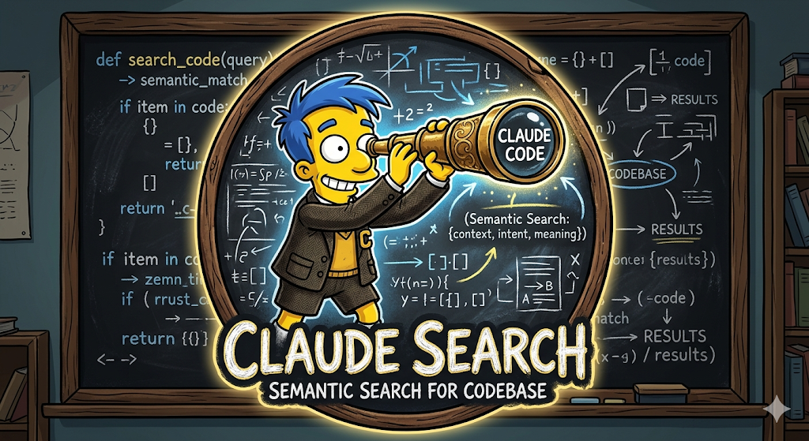

<p align="center">
  
</p>

# cc-search

A Claude Code plugin for **semantic search over your conversation history**. Find past conversations by meaning, not just keywords. Runs 100% locally — no data leaves your machine.

## Features

- **Semantic search** — finds conversations by meaning using `all-MiniLM-L6-v2` embeddings
- **Fully local** — all embeddings and search happen on your machine, zero network access after first model download
- **Fast** — pre-indexed with SQLite + `sqlite-vec`, sub-second search over thousands of conversations
- **Project-scoped** — defaults to searching the current project, `--all` for everything
- **Resume links** — every result includes `claude --resume <session-id>` to jump back in

## Install

### As a Claude Code Plugin

Inside Claude Code, run:

```
/plugin marketplace add mikeler216/cc-search
/plugin install cc-search@cc-search
```

On first use of `/search-history`, the command will auto-install the `cc-search` binary and build the search index.

### Manual / Standalone CLI

```bash
curl -fsSL https://raw.githubusercontent.com/mikeler216/cc-search/main/scripts/install.sh | bash
cc-search index
```

Or download a pre-built binary directly from the [releases page](https://github.com/mikeler216/cc-search/releases).

## Usage

### CLI

```bash
# Search current project's conversations
cc-search query "how did I set up auth?"

# Search all projects
cc-search query "database migration" --all

# Limit results
cc-search query "react state" --top 3

# Update index with new conversations
cc-search index

# Check index status
cc-search status
```

### Claude Code Skill

Use `/search-history <query>` or just ask naturally:

> "Do you remember that conversation where we set up JWT auth?"

> "Find the conversation about the database migration bug"

## How It Works

1. **Index** — Reads conversation JSONL files from `~/.claude/projects/`, splits into turns, generates embeddings with `all-MiniLM-L6-v2`, stores in SQLite with `sqlite-vec`
2. **Search** — Embeds your query, runs cosine similarity search, returns top matches with resume links
3. **Incremental** — Only re-processes new or changed conversation files

## Requirements

- macOS or Linux (x86_64 or arm64)
- No runtime dependencies — the binary is self-contained

## Tech Stack

- **Go** — single static binary, no runtime dependencies
- **all-MiniLM-L6-v2 (ONNX)** — local embedding model via ONNX Runtime
- **sqlite-vec** — vector search extension for SQLite
- **cobra** — CLI framework

## License

MIT
